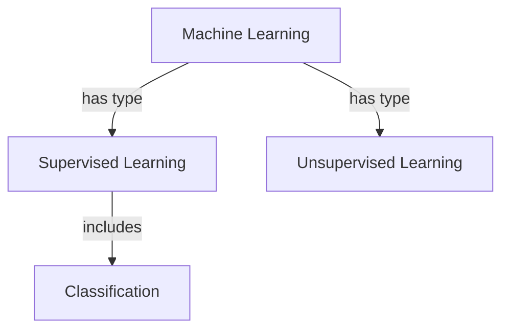

# Lecture Study Guide Generator

[](https://www.python.org/downloads/)
[](https://opensource.org/licenses/MIT)

**Transform lecture slides into comprehensive study materials using AI.** This tool converts PowerPoint presentations and PDF slides into study guides with practice questions, flashcards, concept maps, and more.


## Features

- **Multi-Format Support**: Process PowerPoint (.pptx) and PDF lecture slides
- **AI-Powered Analysis**: Uses Claude or GPT to understand and synthesize content
- **Study Guide Generation**: Creates organized summaries with key concepts
- **Practice Questions**: Generates multiple choice, short answer, true/false, fill-in-blank, and essay questions
- **Flashcard Export**: Creates Anki-compatible flashcard decks for spaced repetition
- **Concept Maps**: Visualizes relationships between topics (Mermaid diagrams)
- **Content Analysis**: Identifies high-density areas that need extra review
- **Multiple Export Formats**: Markdown, JSON, Anki TXT/CSV

## Quick Start

### Installation

```bash
# Clone the repository
git clone https://github.com/yourusername/lecture-study-guide-generator.git
cd lecture-study-guide-generator

# Install dependencies
pip install -r requirements.txt

# Or install as package
pip install -e .
```

### Set Up API Key

```bash
# For Anthropic (Claude) - Recommended
export ANTHROPIC_API_KEY="your-api-key"

# OR for OpenAI
export OPENAI_API_KEY="your-api-key"
```

### Basic Usage

```bash
# Generate study guide from PowerPoint
lecture-study-guide lecture.pptx -o output/

# Generate from PDF
lecture-study-guide slides.pdf -o output/

# Use OpenAI instead
lecture-study-guide lecture.pptx -o output/ --provider openai

# Customize output
lecture-study-guide lecture.pptx -o output/ --questions 30 --flashcards 50
```

### Python API

```python
from lecture_study_guide import StudyGuideGenerator

# Initialize with API key
generator = StudyGuideGenerator(api_key="your-api-key")

# Generate study guide
study_guide = generator.generate(
    "lecture.pptx",
    num_questions=20,
    num_flashcards=30
)

# Export to multiple formats
generator.export_all(study_guide, "output/")

# Access components directly
print(f"Title: {study_guide.title}")
print(f"Concepts: {len(study_guide.concepts)}")
print(f"Questions: {len(study_guide.practice_questions)}")
print(f"Flashcards: {len(study_guide.flashcards)}")
```

## 📖 Output Examples

### Study Guide (Markdown)

```markdown
# Introduction to Machine Learning

## Summary
This lecture covers the fundamentals of machine learning...

## Key Concepts

### Supervised Learning
**Definition:** A type of machine learning where the model learns from labeled data...
**Examples:** Classification, Regression
**Related concepts:** Training data, Labels, Features

## Practice Questions

**Q1.** What distinguishes supervised learning from unsupervised learning?
<details><summary>Show Answer</summary>
Supervised learning uses labeled training data...
</details>
```

### Flashcards (Anki Format)

```
What is supervised learning?	A ML approach using labeled training data	machine-learning concept
What are the two main types of supervised learning?	Classification and Regression	machine-learning types
```

### Concept Map (Mermaid)



## Configuration

### Command Line Options

| Option | Description | Default |
|--------|-------------|---------|
| `-o, --output` | Output directory | `output/` |
| `--api-key` | AI API key | env var |
| `--provider` | AI provider (anthropic/openai) | anthropic |
| `--model` | Specific model name | auto |
| `--questions` | Number of practice questions | 20 |
| `--flashcards` | Number of flashcards | 30 |
| `--formats` | Export formats | all |
| `--question-types` | Question types to generate | all |

### Question Types

- `multiple_choice` - 4-option multiple choice
- `short_answer` - Brief written responses
- `true_false` - True/false statements
- `fill_in_blank` - Complete the sentence
- `essay` - Extended response questions

## Project Structure

```
lecture-study-guide-generator/
├── lecture_study_guide/
│   ├── __init__.py          # Package init
│   ├── core.py               # Main StudyGuideGenerator class
│   ├── models.py             # Data models (StudyGuide, Flashcard, etc.)
│   ├── cli.py                # Command-line interface
│   ├── extractors/           # Content extraction
│   │   ├── base.py           # Base extractor class
│   │   ├── pptx_extractor.py # PowerPoint extraction
│   │   └── pdf_extractor.py  # PDF extraction
│   ├── generators/           # AI-powered generation
│   │   ├── base.py           # AI provider wrapper
│   │   ├── study_guide_generator.py
│   │   ├── question_generator.py
│   │   ├── flashcard_generator.py
│   │   └── concept_map_generator.py
│   ├── exporters/            # Export formats
│   │   ├── anki_exporter.py  # Anki flashcard export
│   │   ├── markdown_exporter.py
│   │   └── json_exporter.py
│   └── utils/                # Utilities
├── tests/                    # Test suite
├── samples/                  # Sample lecture files
├── docs/                     # Documentation
├── requirements.txt
├── setup.py
└── README.md
```

## Development

### Setup Development Environment

```bash
# Clone and setup
git clone https://github.com/yourusername/lecture-study-guide-generator.git
cd lecture-study-guide-generator

# Create virtual environment
python -m venv venv
source venv/bin/activate  # or `venv\Scripts\activate` on Windows

# Install with dev dependencies
pip install -e ".[dev]"
```

### Run Tests

```bash
# Run all tests
pytest

# With coverage
pytest --cov=lecture_study_guide

# Specific test file
pytest tests/test_extractors.py
```

### Code Quality

```bash
# Format code
black lecture_study_guide/

# Lint
ruff check lecture_study_guide/

# Type checking
mypy lecture_study_guide/
```

## Contributing

Contributions are welcome! Please feel free to submit a Pull Request.

1. Fork the repository
2. Create your feature branch (`git checkout -b feature/AmazingFeature`)
3. Commit your changes (`git commit -m 'Add some AmazingFeature'`)
4. Push to the branch (`git push origin feature/AmazingFeature`)
5. Open a Pull Request

## License

This project is licensed under the MIT License - see the [LICENSE](LICENSE) file for details.

## Acknowledgments

- [Anthropic Claude](https://www.anthropic.com/) for AI capabilities
- [python-pptx](https://python-pptx.readthedocs.io/) for PowerPoint parsing
- [pdfplumber](https://github.com/jsvine/pdfplumber) for PDF extraction
- [Anki](https://apps.ankiweb.net/) for spaced repetition

## Contact

Saurish Uddaraju - [@suddaraju2](svu7@scarletmail.rutgers.edu)

Project Link: [https://github.com/yourusername/lecture-study-guide-generator](https://github.com/yourusername/lecture-study-guide-generator)
